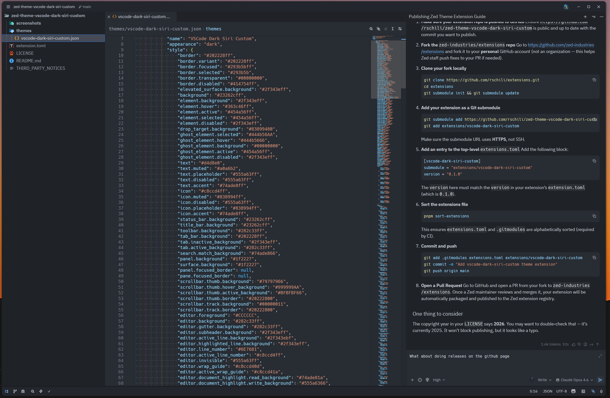

# VSCode Dark Siri Custom theme for [Zed](https://zed.dev/)

This is a combination of my two favorite themes for zed right now.
The window layout uses [Siri Code](https://github.com/perragnar/zed-theme-siri) with little customizations
The inner syntax uses [VSCode Dark Modern](https://github.com/kevcamel/vscode_dark_modern.zed) I'm very used to VSCodes dark+ theme so this just feels right
The combination of those two themes with some customizations is what I use on my personal Zed setup.

## Installation

You can install the theme from the official [Zed extension repository](https://zed.dev/extensions): open the command palette (<kbd>Cmd</kbd>+<kbd>Shift</kbd>+<kbd>P</kbd>) and run `zed: extensions`. Search for `VSCode Dark Siri Custom` and install it.
